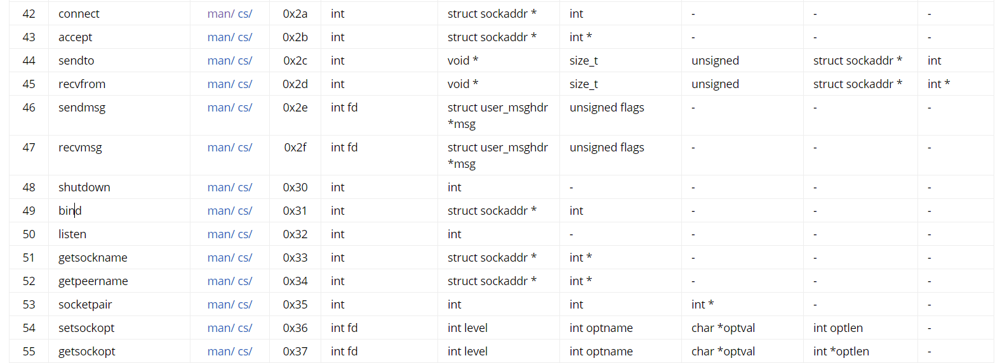
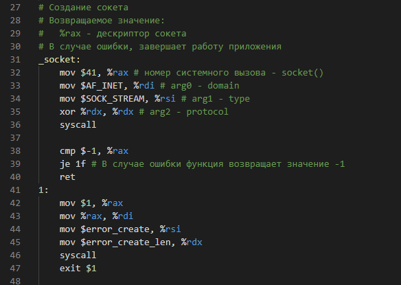
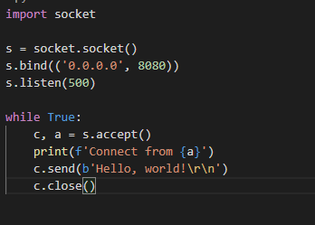
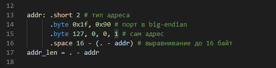
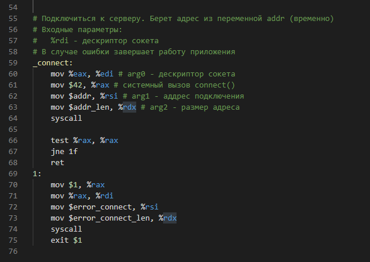
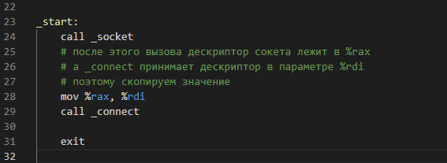
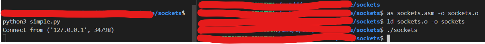

# Простой веб-сервер на ассемблере.
Сижу я тут, пытаюсь к зачетам/экзаменам "готовиться" и решил, а почему бы
не написать хотя бы самый простой веб-сервер, да не абы на чем, а на ассемблере.

В принципе в интернете есть статьи, но какая разница, статьей больше, статьей меньше.

(В начале думал, что это будет короткая заметка, но оказалось что как-то и многовато всего).

## Введение.
Грубо говоря сервер, это какое-то приложение, которое работает в цикле, и ждет,
пока к нему кто-нибудь подключится. Приставка __веб__ дает понять, что это какой-то
HTTP сервер.

Зафиксируем задачи. Нужно найчится:
1. Научиться слушать порт - разобраться как работать с сокетами.
2. Разобрать основы работы протокола HTTP, чтобы отправлять правильные запросы и видеть результат
в браузере.

_Примечание. Буду писать под Ubuntu_
_20.04, x86_64, GNU Assembler (стандартная команда as),_
_GNU LD (стандартная команда ld) В синтаксисе AT&T_

## Часть 1. Создание сокетов и подключение к серверу.
Для сетевого взаимодействия будем использовать __сокеты Беркли__. Для этого нужно пролистать список системных вызовов, 
например [здесь](https://chromium.googlesource.com/chromiumos/docs/+/master/constants/syscalls.md#x86_64-64_bit).

Наибольший интерес представляет диапазон 41-55 (смотрим syscalls для x86_64)



Попробуем сначала создать клиента, который будет подключаться к серверу и пытаться вывести пришедшую информацию.

### Шаг 1. Создание сокета.

Чтобы создать сокет, необходимо воспользоваться 41-ым системным вызовом:

`int socket(int domain, int type, int protocol)`

* domain - тип протокола сетевого уровня (в стеке протоколов TCP/IP). Этот параметр определеяет какие адреся мы использовать.
IPv6 является все еще недостаточно популярным, поэтому нас инетересует IPv4. Согласно документации это константа AF_INET = 2.
* type - грубо говоря протокол транспортного уровня - TCP или UDP. Нам нужен TCP, поэтому значение SOCK_STREAM = 1.
* protocol - какие-то специфические параметры, с которыми я не до конца разобрался (уж простите), понял, что его нужно занулить.

Полную информацию по функции можно глянуть [здесь](https://man7.org/linux/man-pages/man2/socket.2.html) 

Итак, код имеет следующий вид.


```
Ликбез
    Согласно соглашениям о системных вызовах, в x86_64:
    %rax - номер системного вызова
    %rdi - первый аргумент
    %rsi - второй аргумент
    %rdx - третий аргумент
    Возвращаемое значение лежит в %rax
```

### Шаг 2. Подключение к серверу.
Это систеный вызов 42 (прям как ответ на все вопросы):

`int connect(int sockfd, const struct sockaddr *addr, socklen_t addrlen)`
* sockfd - дескрипктор сокета, полученный на предыдущем шаге.
* *addr - указатель на структуру, которую разберем чуть позже.
* размер этой самой структуры.

__sockaddr__ - это некоторая обобщенная структура, зависящая от типа используемого сокета, и состоит по крайней мере из 16 байт. Так как мы используем IPv4, то нам интересна структура sockaddr_in (определение есть в <netinet/in.h>):
```
sockaddr_in {
    short sa_family # = AF_INET
    short sa_port # в формате big-endian например если порт 1, 0x0100
    long sa_addr # big-endian, например если адрес 127.0.0.1, то 0x0100007f
    <padding до 16 байт>
}
```
Напишем небольшой python-скрипт, который при подключении к нему будет просто отправлять hello, а в консоль выводить информацию о подключении:



Определяем адрес:



Подключаемся к "серверу":



Теперь вызываем наши функции в точке входа, получаем нечто такое:



Проверим работу. Запустим наш python скрипт в качестве сервера и соберем и запустим наш asm файл:



Ура, теперь мы умеем подключаться в режиме клиента. Больше в следующих частях.

P.S. Хотел написать прям мини-статью, но выходит чуть побольше и пишу и рефакторю код прямо по ходу написания, поэтому решил разбить на несколько частей (две или три наверн) :)