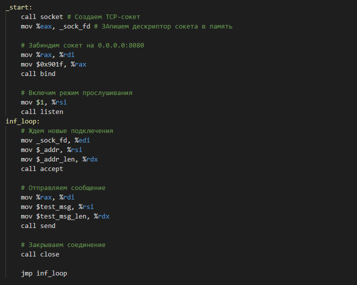

## Простой веб-сервер на ассемблере. Часть 2

Как мне показалось, предыдущая статья получилась скомканной, не все объяснил, показывал лишь какие-то участки кода.
После публикации решил немного реструктуризировать код - ввел пока следующую структуру:
* helpers.asm - здесь лежат макросы типа exit и print которые немного упрощают написание
* socket.asm - здесь функции для взаимодействия с сокетами
* main.asm - главный файл в котором будем вызывать описанные функции

Также обещал выложить исходники на гитхаб - [ловите](https://github.com/hariton27sy/asm_server), по ходу дела они будут обновляться.
---
В этой части попытаемся запустить уже сервер, который при подключении будет просто печатать информацию о клиенте и разрывать соединение.
Приступим.

## How to:
Необходимо создать сокет, который будет слушать заданный порт, для этого нужно проделать следующие шаги:
1. Создать сокет с помощью уже известного нам вызова __socket__
2. Привязать сокет к адресу и порту с помощью системного вызова __bind__
3. Переключить сокет в пассивный режим с помощью вызова __listen__
4. Начать принимать соединения с помощью __accept__
5. Грамотно отключать клиента с помощью вызова __shutdown__

Опишу вкратце про вызовы 2-5:
### __bind__
`int bind(int sockfd, const struct sockaddr *addr, socklen_t addrlen)`

Уже знакомые нам параметры, которые биндят сокет. Стоит заострить внимание, что если порт занят,
то данный вызов вернет значение отличное от нуля. Просто сравниванием с нулем, и если что-то не так,
то завершаем приложение. 

Для простоты реализации я решил привязывать сокет к адресу 0.0.0.0,
то есть принимать входящие запросы с любого интерфейса ПК. У меня получилась вот такая функция:

### __listen__
`int listen(int sockfd, int backlog)`

* sockfd - дескриптор сокета.
* backlog - максимальное число одновременных подключений.

Функция переключает сокет в режим прослушивания. Простая реализация:

### __accept__
`int accept(int sockfd, struct sockaddr *addr, socklen_t *addrlen)`

* sockfd - дескриптор сокета
* *addr - указатель на память, куда будет записан адрес подключающегося клиента
* *addrlen - указатель на память, куда будет записано значение - размер предыдущей структуры

Эта функция дает возможность уже непосредственно принимать соедения от пользователей. Она возращает
дескриптор нового, связанного с клиентом сокета. После подключения и обработки его нужно закрыть,
чтобы разорвать соединение с пользователем. Для этого используем следующий вызов

### __shutdown__
`int shutdown(int sockfd, int how)`

* sockfd - дескриптор сокета
* how - что запретить: 0 - запретить получение на этом сокете, 1 - запрет отправлять, 2 - закрыть все

Функция просто закрывает дескриптор сокета. Пример реализации:

### __sendto__
`ssize_t sendto(int sockfd, const void *buf, size_t len, int flags, const struct sockaddr *dest_addr, socklen_t addrlen)`

* sockfd - дескриптор подключения
* *buf - указатель на сообщение
* len - длина сообщения
* flags - какие-то флаги (нам не нужно)
* *dest_addr - адрес назначения, используется для UDP и других сокетов, поэтому просто заиваем 0
* addrlen - аналогично

Отправляет сообщение клиенту. Пример реализации

### Объединяем воедино
Теперь, когда мы описали все функции, мы можем легко и просто объединить все в главном файле.
Будем в вечном цикле слушать сокет, а при подключении отправлять какое-то сообщение и закрывать
соединение. Легко и просто:
